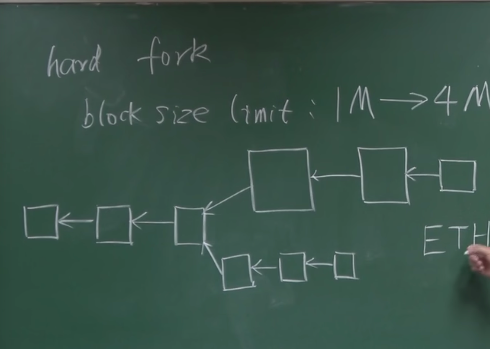
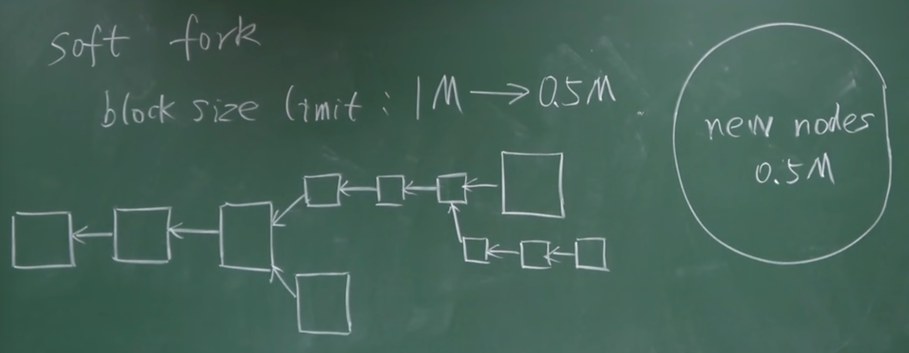

# 分叉

state fork

- forking attack
- deliberate fork

protocal fork

- hard fork:硬分叉 --- 如果不愿更新，肯定会出现永久性分叉

  - 旧节点不认可新的 feature
  - e.p : block limit size 大概每秒 7 笔交易 1M=>4M
    
  -

- soft fork 软分叉--- 不会出现永久性分叉
  - 新协议导致原先的区块可能不再合法
    

## 参考

[北京大学肖臻老师《区块链技术与应用》](https://www.bilibili.com/video/av37065233/?p=10)
