# 区块链技术与应用 - 课堂笔记

# 区块链

- 概念： 分布式账本。 它是许多参与者共享的特定类型的数据库。这个特殊的数据库只是一个交易列表，记录着网络中发生的每笔交易。
- 特点:
  - 每个人都可以拥有自己的交易列表备份。
  - 强有力的货币激励措施消除各方之间信任成本。
- 解决了什么问题：
  - 摒弃信任中介。 （传统交易通常引入第三方来解决相互不信任的人进行的交易，如：支付宝、银行。）
- 如何做到
  - 每个人都具有相同的交易列表，因此很难欺骗网络接受虚假交易。
  - 通过与一些加密算法和货币激励相结合，鼓励所有节点积极参与记账以及规避作弊。
  - 区块链**几乎**无法篡改。 改变历史记录的唯一方法是让大多数节点（矿工）同意这样做
- 坊间观点
  - 下一代价值互联网。- 蒸汽机之于第一次工业革命
  - 世界上最慢的数据库/庞氏骗局
  - 总结： 技术本身和商业运作是不同的，技术就是为了解决某一系列问题，其本身并不应该被抨击。

比特币本身仅是基于区块链这一技术的一种加密货币（除此之外还有莱特币、以太币等许多种加密货币），而区块链技术的应用却远不止于此。

# BTC

## 密码学原理

### Hsah

密码学中，采用的哈希函数称为名**cryptographic hash function。**其两个重要性质分别为**collision resistance**（对哈希碰撞具有抗拒性）和**hiding(隐藏性)**

#### collision resistence

给定 x 和 y，且有 x!=y，但给定一个哈希函数 Hash()，可以得到 Hash(x)=Hash(y)，则称为**hash 碰撞。**
产生原因：输入空间大于输出空间。
比如 256 位的哈希值，输出空间 2^256，输入空间无限 ，根据鸽笼原理，终究会有哈希碰撞。
collision resistance 保证,如果有 Hash(x) != Hash(y)，必然可以得到 x!=y。（当然，这是理想状态，实际应用中，哈希碰撞基本上难以避免。目前并不存在一个 hash 函数可以从数学上证明具有 collision resistance 的性质）

- 作用：
  - 对 message 求 digest （比如版本管理）。
  - 此时告诉某人 H(x)， 彼时某人拿到 x 求证，可验证当初 x 消息是否准确。

某些哈希函数经年后，人们找到了人为制作哈希碰撞的方法，故不再安全。 如 md5。

#### hiding

无法从散列值逆向推导出原始数据。

#### collision resistance 和 hiding 结合实现 digital commitment / digital equivallent of a sealed envelope(数据保证)：

实际使用中，为了 x 足够大，会对 x 进行“加盐”，对 x 拼接一个 nonce，对其整体取 Hash。
即： ** x + nonce => H(x & nonce) **

#### puzzle friendly

在在比特币系统中，还需要第三个性质 Puzzle friendly。该性质要求哈希值计算事先不可预测，仅仅根据输入很难预测出输出。例如：我们需要一个哈希值，存在于某一个范围内，只能通过不停运算查找出来。
该性质保证了比特币系统中，只能通过“挖矿”获得比特币。也就是说，该性质保证了工作量证明(POW)机制可以运行下去【“difficult to solve，but easy to verify”】。
在比特币系统中采用 SHA-256 哈希函数

### 签名

- 比特币账户创立

本地建立公私钥对（asymmetric encryption algorithm 非对称加密）。
公钥相当于，银行账号；私钥相当于银行卡密码；
加密主要用于签名， **比特币交易需要用私钥签名，其他人用公钥验证。**
在发布交易时，通过自己私钥签名，其他人可以根据公钥进行验证，从而保证该交易由自己发起。也就是说，只有拥有私钥，才能将该账户中的比特币转走。

> 注：无限生成公私钥对，也很难产生重复数据。 a good source of randomness

## 数据结构

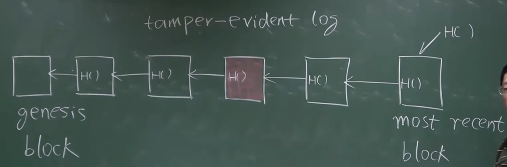
Blockchains are linked lists using hash Pointers.

### 哈希指针

哈希指针是一个包含两个部分的数据结构

- 指针：指向特定数据的位置（如内存地址或磁盘位置）。
- 哈希值：该位置数据通过哈希函数计算得出的哈希值。用 H()表示

**在区块链中的应用：**
每个区块通过哈希指针链接到前一个区块，形成一条不可篡改的链。

> 1. 区块头（Block Header）:
>    • 前一个区块的哈希值（Previous Block Hash）: 指向前一个区块的哈希值，用于维持区块链的连贯性和安全性。
>    • 默克尔根（Merkle Root）: 交易的哈希值通过 Merkle 树结构计算出的根哈希值，用于快速验证区块中交易的完整性。
>    • 时间戳（Timestamp）: 区块创建的时间，用于记录区块生成的时间点。
>    • 难度目标（Difficulty Target）: 当前区块的挖矿难度目标，决定了生成区块所需的计算难度。
>    • 随机数（Nonce）: 挖矿过程中不断变化的值，用于找到满足难度目标的有效哈希值。
> 2. 区块体（Block Body）:
>    • 交易列表（Transaction List）: 包含所有在该区块中记录的交易。每个交易通常包括：

    •	交易ID（Transaction ID）: 交易的唯一标识符。
    •	输入（Inputs）: 交易的输入部分，指向前一交易输出的引用。
    •	输出（Outputs）: 交易的输出部分，指定接收者和发送金额。
    •	其他信息: 可能包括交易签名等。

```javascript

Block {
  Block Header {
      Version: 1,
      Previous Block Hash: "00000000000000000000...",
      Merkle Root: "4d3f5a5a1a2b4f32...",
      Timestamp: 1624068325,
      Difficulty Target: "170db8ff",
      Nonce: 2083236893
  },
  Transactions [
    Transaction {
      Transaction ID: "e3a1f...",
      Inputs: [
        {Previous Output: "txid:abcd..., index: 0", Signature: "3045..."}
      ],
      Outputs: [
        {Value: 50, Address: "1A1zP..."}
      ]
  },
    ...
    ]
}

```

### merkle tree 默克尔树

默克尔树是一个二叉树，其中每个叶子节点（Leaf Node）包含数据项的哈希值，而每个非叶子节点（Parent Node）包含其子节点哈希值的组合哈希值。树的根节点（Merkle Root）是最上层的节点，包含整个树的哈希值。

```
交易A, 交易B, 交易C, 交易D
哈希A, 哈希B, 哈希C, 哈希D

父节点:
哈希AB = Hash(哈希A + 哈希B)
哈希CD = Hash(哈希C + 哈希D)

根节点:
默克尔根 = Hash(哈希AB + 哈希CD)
```

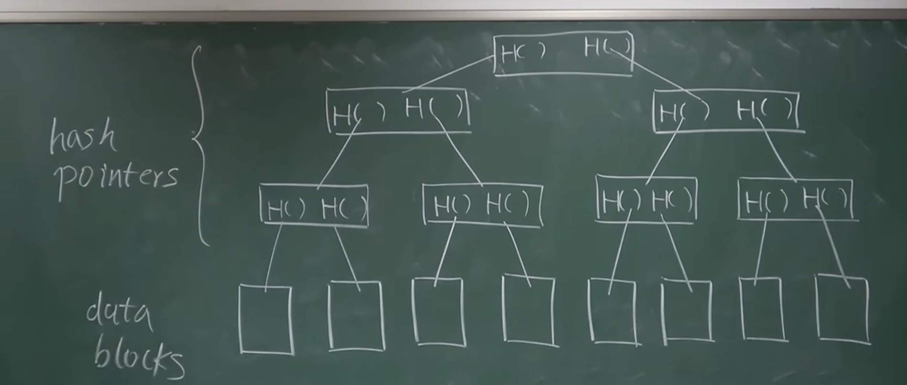

> data blocks 即为交易 transaction
> 在比特币系统中，不同区块通过哈希值指针连接，在同一个区块中的多个交易（数据块），则通过 Merkle Tree 的形式组织在一起。区块本身分为两部分（块头和块身），在块头中存在有根哈希值（没有交易的具体信息），块身中存在交易列表。

该数据结构的优点在于：只需要记住 Root Hash（根哈希值），便可以检测出对树中任何部位的修改。
例如，所绘制 Merkle Tree 中节点 B 发生了改变，则对应的第二层第一个节点中第二个哈希值便也会发生改变，进而根节点中第一个哈希值也会发生改变，从而导致根哈希值也发生了改变。

**在区块链中的应用：**
Merkle Tree 可以用于提供 Merkle Proof（ 用于验证某个交易是否包含在 merkle tree）。关于 Merkle proof，需要先了解比特币系统中节点。比特币中节点分为**轻节点**和**全节点**。全节点保存整个区块的所有内容，而轻节点仅仅保存区块的块头信息。
比特币节点分为：

- 全节点 （block header + block body） ： full node / full validating node
- 轻节点 （block header）： light node
  > 为什么要分轻节点和全节点？
  > 因为硬件的局限。一个区块大小为 1MB，对于移动便携设备来说，如果存储区块的所有内容，则所需空间过大，而这是不现实的。所以轻节点只需要存储区块块头信息，全节点存储区块所有内容即可。

当需要向轻节点证明某条交易是否被写入区块链，便需要用到 Merkle proof。我们将交易到根节点这一条路径称为 Merkle proof，全节点将整个 Merkle proof 发送给轻节点（如下图所示），轻节点即可根据其算出根哈希值，和自己保存的对比，从而验证该交易是否被写入区块链。只要沿着该路径，所有哈希值都正确，说明内容没有被修改过。
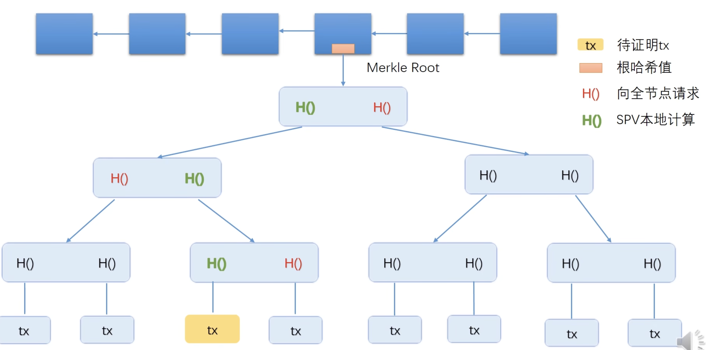

**延伸**

- **Proof of Membership**
  - 证明成员关系（Proof of Membership），也称为默克尔证明（Merkle Proof）
- **Proof of Nonmembership**
  - 证明非成员关系（Proof of Nonmembership）用于证明某个数据项不在某个集合中。常用的方法包括使用改进的默克尔树，如默克尔前缀树（Merkle Patricia Trie）、排序默克尔树或更复杂的结构如 Merkle Interval Tree。

## 共识协议

为避免各自为政，区块链需要一套共识协议来确保区块链网络中所有参与节点就数据的一致性达成一致。

> 共识协议（Consensus Protocol）是分布式系统和区块链中的一种机制，用于在多个节点之间达成一致意见。

比特币本质是一种数字货币。相较于现实货币：

- 交易灵活。

自身问题：

- **即是货币，那发行由谁执行？如何发行？发行多少？什么时候发行？**
  - 当引入去中心化思想后，系统中节点平等，交易不通过第三方，那么货币发行权的分配必然是一个需要解决的问题。
  - **在比特币系统中由挖矿来决定货币发行权和发行量。**
- **如何验证交易是否有效？如何防止双花攻击？**
  - 该问题的解决，依赖于系统中维护的一个数据结构，记录货币的使用情况（是否被花过？被谁花过？）。该数据结构由系统中全体用户共同维护，保证了交易的有效性。该数据结构，便是区块链。
    > 数字货币本身为带有签名的数据文件，可以进行复制。即：对用户来说，可以将同一货币花费两次。

### 比特币的发行

- 挖矿求解问题：`Hash（block header + nonce）<= target`

找出符合条件的 nonce，找到之后：将获得记账权 + **Block Reward。**

- 当一个矿工成功挖出一个新的区块并将其添加到比特币区块链上时，该矿工有资格获得一个固定数量的新比特币作为奖励。
- 除了区块奖励外，矿工还可以收取每个交易的交易费用。交易发起者为了优先被打包进区块链，会向矿工支付一定数量的比特币作为交易费用。
- 所谓记账权，其实是候选区块转正的过程。
- 交易验证

比特币要求每笔交易都表明该币的来源。
比如，假定 A 获得**铸币权**，新发布了 10 个比特币（该交易称为铸币交易）。A 将 10 个比特币转给了 B(5 个)和 C(5 个)，A 对该交易进行签名，同时该交易需要说明所花掉 10 个比特币来源（来自铸币交易）。之后，B 将自己的 5 个比特币转给 C(2 个)和 D(3 个)，该交易需要 B 的签名，该交易需要说明所花掉的 5 个比特币来自于第二个交易中。然后，C 将自己所拥有的全部 7 个比特币都转给 E，并对该交易签名，可以发现该交易中 C 的比特币来源于两个交易中。这样，就构成了一个简单的区块链。**【红色部分为比特币来源】**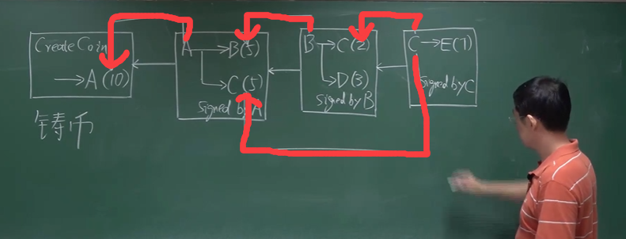

> 这里面有两种哈希指针。
> 第一种为指向前面的区块（白色），使得各个区块形成链；
> 第二种则是为了说明比特币的来源（红色）。说明比特币的来源并非凭空捏造，可以防止双花攻击。
> 在进行交易时，需要付款人的签名和收款人的地址，在比特币系统中，该地址即为收款人的公钥的哈希。可以将其视为银行账户，根据此进行转账交易。（虽然公钥可以公开，但实际中更多公开的是公钥的哈希）
> 在交易中，收款方需要知道付款方的公钥，从而验证 A 签名是否有效。即 A 需要提供自己的公钥，如果所提供公钥与铸币交易中？？？。（实际上其他节点都需要知道付款方公钥，验证交易合法性）
> 实际中 A 转账时候提供的公钥需要和铸币交易中公钥对的上，这样就防止了恶意节点伪造 A 的公钥来“偷”走 A 的比特币。
> 在比特币系统中，通过执行脚本实现上述验证过程。将当前交易输入脚本与前一个交易输出脚本（说明币的来源的交易）拼接执行，如果可以正确执行，说明交易合法。

比特币每个交易包含输出、输入

- 输入：币的来源**Previous Transaction Hash**（解决双花） + 付款人的公钥 （方便其他节点验证）
- 输出：收款人公钥的哈希
  > 举例：
  > 当 A 转账给 B
  >
  > 1. 获知收款方 B 的地址（公钥的哈希）: B 需要主动告知
  > 2. B（乃至所有节点）都需要知道 A 的公钥
  >
  > - 原因： 节点或包含恶意，所有节点都需要验证该交易的合法性
  >
  > 3. 其他节点如何获知 A 的公钥
  >
  > - 输入中包含
  >
  > 4. 如何防止其他节点伪造，如 B' 伪造交易，在输入中暴露自己公钥，用自己私钥签名，伪装成 A。
  >
  > - 输出中包含收款人的哈希，意味着所有币的来源都有迹可循。 转账交易中的 a 的公钥需要和币的来源中的公钥对应。

### 分布式共识

根据 FLP 不可能结论，在一个异步系统中，网络时延无上限，即使只有一个成员是有问题的，也不可能达成共识。
根据 CAP Theorem（Consistency 一致性、Availability 可靠性、Partition tolerance 容错性），任何一个分布式系统中，最多只能满足其中两个性质。
分布式共识中协议 Paxos 可以保证 Consistency（若达成共识必然一致），但在某些情况下，可能会一直无法达成共识。

## 具体实现

区块链是一个去中心化的账本，去中心化的账本的主要记录方式有两种：基于交易的账本（Transaction-based Ledger）和基于账户的账本（Account-based Ledger）。这两种模型在记录和处理交易的方式上有明显的区别。

> **基于交易的账本（Transaction-based Ledger）**
> 这种模式主要由比特币采用，使用的是 UTXO 模型（Unspent Transaction Output **尚未被花掉的交易输出**）。系统中并无显示记录账户包含比特币数，实际上其需要通过交易记录进行推算。
>
> **基于账户的账本（Account-based Ledger）**
> 这种模式主要由以太坊采用，每个账户有一个余额，交易直接修改账户余额。

为什么要维护这样一个数据结构？
为了防范“双花攻击”，判断一个交易是否合法，要查一下想要花掉的 BTC 是否在该集合中，只有在集合中才是合法的。如果想要花掉的 BTC 不在 UTXO 中，那么说明这个 BTC 要么根本不存在，要么已经被花过。所以，全节点需要在内存中维护一个 UTXO，从而便于快速检测 double spending（双花攻击）。

假如有人收到 BTC 转账，但一直不花，那么这个信息会一直保存在 UTXO 中。这种情况可能是该用户不想花这些 BTC(如：中本聪) ，也有可能是忘记了私钥导致无法花掉。所以，UTXO 是逐渐增大的，但该数据目前来说，一个普通的服务器硬盘中是可以完全保存这些数据的。

### BTC 系统中具体的区块信息

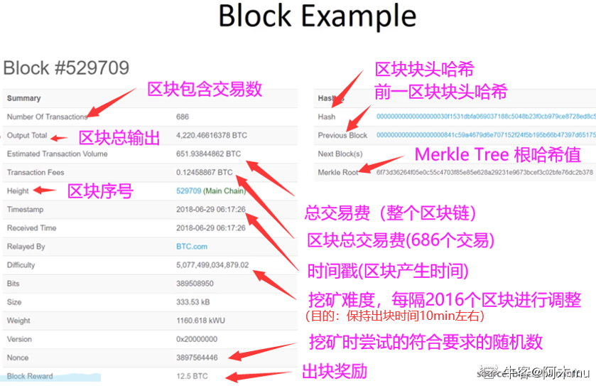
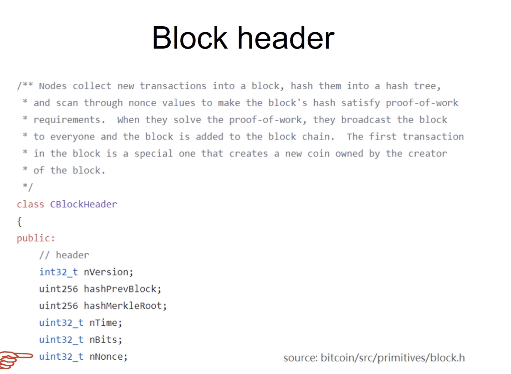

- 什么是挖矿？

可以看到，区块哈希与前一区块哈希都是以一长串 0 开头的，挖矿本身就是尝试各种 nonce，使得产生的区块哈希值小于等于目标阈值。该目标阈值，表示成 16 进制，就是前面含有一长串的 0
nonce 是一个 32 位的无符号整型数据，在挖矿时候是通过不断调整 nonce 进行的，但可以看到，nonce 的取值最多为 2^32(2 的 32 次方)种。但并非将这些 nonce 全部遍历一遍，就一定能找到符合要求的 nonce。由于近年来，挖矿人员越来越多，挖矿难度已经调整的比较大了，而 2^32 这一搜索空间太小，所以仅调整 nonce 很大可能找不到正确的结果。
**仅仅调整 nonce 是不够的，所以这里可以通过修改 Merkle Tree 的根哈希值来进行调整。**
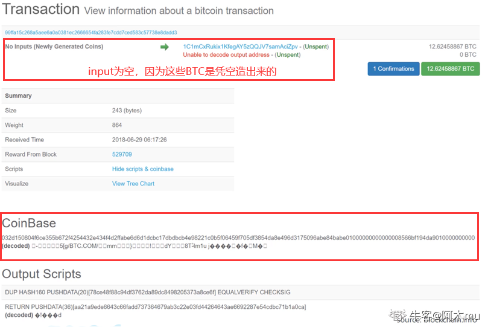
CoinBase 中可以写入任何内容，在这里写什么都没有影响。所以可以在这里添加一些任意信息，便可以实现无法篡改（也无法删除）。
所以，只要我们改变了写入内容，便可以改变 Merkle Tree 的根哈希值。

下图为一个小型的区块链，假定左下角交易为 coinbase 交易，可以看到，该交易发生改变会逐级向上传递，最终导致 Merkle Tree 根哈希值发生改变。
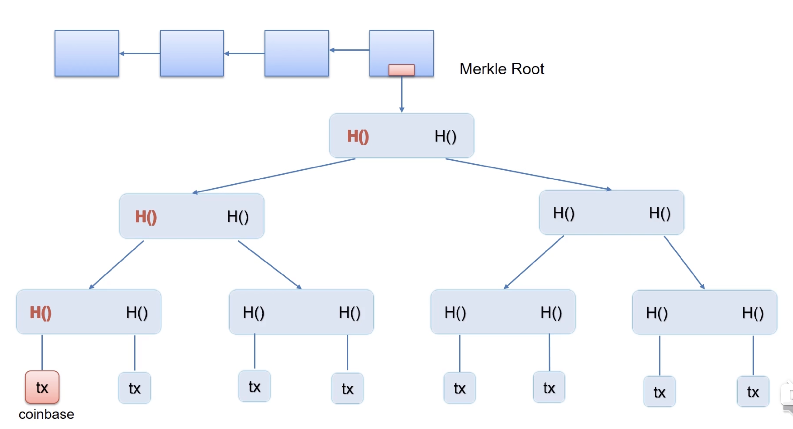

所以，在实际的挖矿中，包含两层循环。外层循环调整 coinbase 域（可以规定只将其中前 x 个字节作为另一个 nonce），算出 block header 中根哈希值后，内层循环再调整 nonce。

### 挖矿难度分析

bernoulli trial: a random experiment with binary outcome
bermoulli process
memoryless
poisson process
exponential distribution
progress free
挖矿本质上是不断尝试各种 nonce，来求解这样一个 puzzle。每次尝试 nonce，可以视为一次伯努利试验。最典型的伯努利试验就是投掷硬币，正面和反面朝上概率为 p 和 1-p。在挖矿过程中，一次伯努利试验，成功的概率极小，失败的概率极大。挖矿便是多次进行伯努利试验，且每次随机。这些伯努利试验便构成了 a sequence of independent Bernoulli trials(一系列独立的伯努利试验)。根据概率论相关知识知道，伯努利试验本身具有无记忆性。也就是说，无论之前做多少大量试验，对后续继续试验没有任何影响。

系统平均出块时间为 10min，该时间为系统本身设计，通过难度调整维护其平均出块时间。
指数分布本身也具有无记忆性。也就是说，对整个系统而言，已经过去 10min，仍然没有人挖到区块，那么平均仍然还需要等 10min（很不符合人的直觉）。也就是说，将来要挖多久和已经挖多久无关。

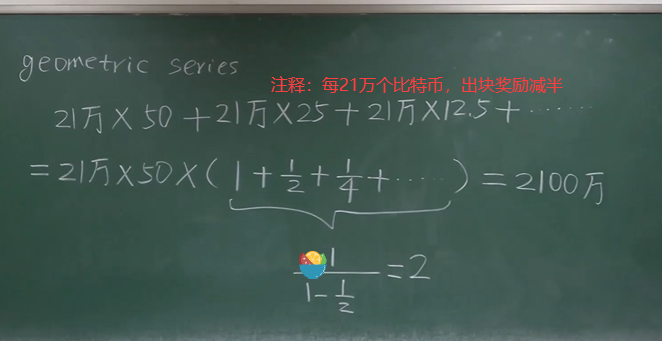
**比特币系统中已经挖出和未挖出的比特币总数便是 2100 万个。**
实际上，挖矿这一操作并非在解决数学难题，而是单纯的算力比拼。也就是说，挖矿这一过程并没有实际意义，但挖矿这一过程，却是对比特币系统的稳定起到重要维护作用。
所以，只要大多数算力掌握在好的节点手中，便能够保障比特币系统的稳定。

### 比特币系统安全性分析

1. 可否"偷币"？（恶意节点能不能将其他账户上比特币转给自己？）
   答案：不能。因为转账交易需要签名，恶意节点无法伪造他人签名。加入其获得记账权并硬往区块中写入该交易，大多数用户会认为其是一个非法区块，大多数算力将不认可该区块，从而沿着其他路径挖矿，随着时间推移，拥有大多数算力的诚实的节点将会仍然沿着原来区块挖矿，从而形成一条“最长合法链”，该区块变成孤儿区块。对于攻击者来说，不仅不能偷到其他人的比特币，而且得不到出块奖励，还浪费了挖矿花费的电费等成本。
2. 可否将已经花过的币再花一遍？
   如下图 1，若 M 已经将钱转给 B，现在想再转给自己，假设其获得记账权，若按照图 1 方式，很明显为一个非法区块，不会被其他节点承认。
   所以，M 只能选择图 2 方式，将 M 转账给 B 的记录回滚掉。这样就有了两条等长合法链，取决于哪一个会胜出。（如果上面交易产生不可逆的外部效果，下面交易回滚便又拿回钱，从而不当获益）

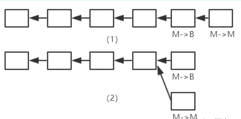

- 如何防范这种攻击？？？
  如果再 M->B 这个交易之后还延续有几个区块，如下图所示，则大多数诚实节点不会承认下面的链。所以，便变成了恶意节点挖下面的链，其他节点挖上面的链的算力比拼。由于区块链中大多数节点为善意节点，则最终上面链会胜出，而恶意节点的链会不被认可，从而导致投入成本白费。
- 所以，一种简单防范防范便是多等几个确认区块。比特币协议中，缺省需要等 6 个确认区块，此时才认为该记录是不可篡改的。平均出块时间 10min，六个确认区块便需要 1 小时，可见等待时间还是相对较长的。

3. 可否故意不包含合法交易？
   可以，但是可以等待后续区块包含，所以问题不大。实际运行中，可能由于某段时间实际交易数太多，而一个区块包含交易数存在最大值，导致某些合法交易并未被写入区块链（等待后续区块写入）。
4. selfish mining
   提前挖到但不发布，继续挖下去，等到想要攻击的交易等了 6 次确认认为安全之后将整条链发布出去，试图回滚原来记录。这种情况，需要恶意节点掌握系统中半数以上算力才行，否则无法成为最长合法链。

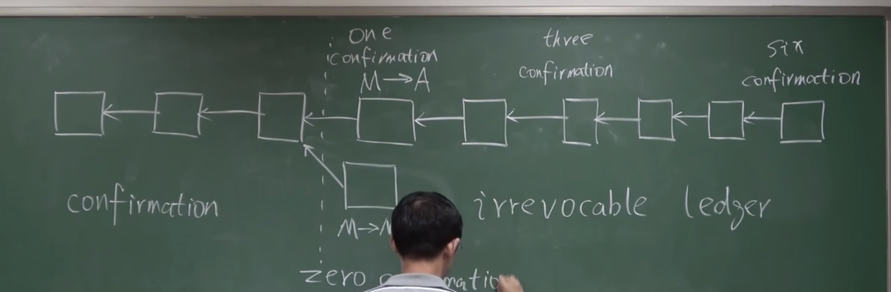

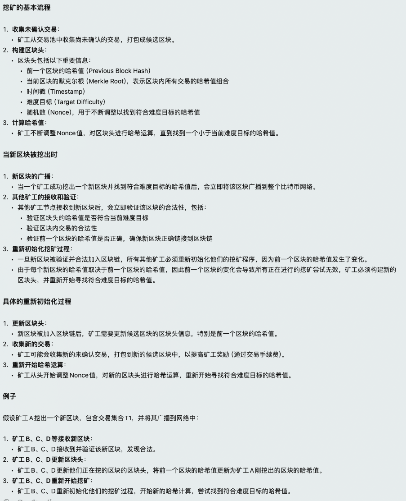
selfish mining

## 网络

用户将交易发布到比特币网络中，节点收到交易打包到区块，再把区块发布到网络上。
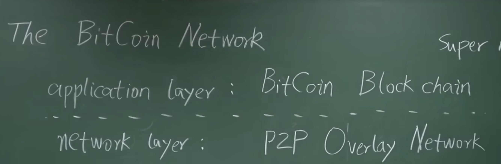
用户将交易发布到比特币网络上，节点收到交易后打包到区块中，然后将区块发布到比特币网络上，那么新发布的交易和区块在比特币网络上是如何传播的呢？
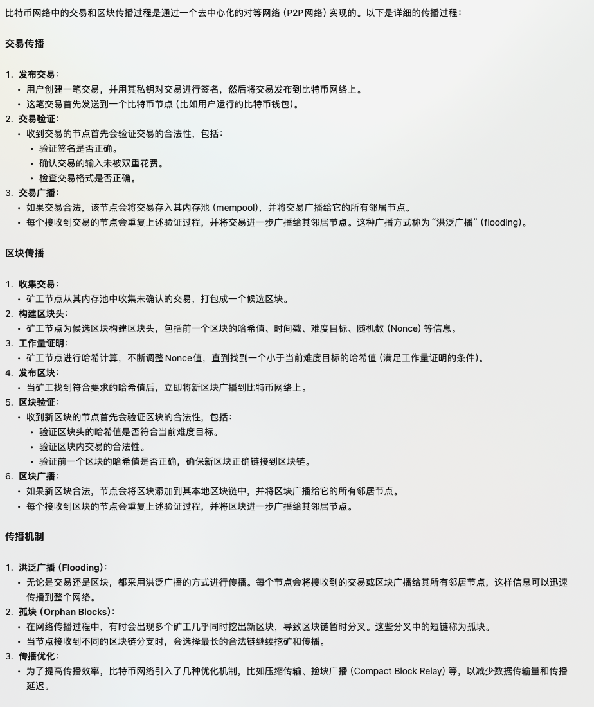
P2P（Peer-to-Peer）是指点对点网络，这种网络架构没有中心化的服务器或中介，每个参与者（节点）都具有相同的地位，能够直接与其他节点进行通信和数据交换。P2P 网络的主要特点包括去中心化、分布式、容错性强和可扩展性好。

- 假如网络中存在两个冲突交易，如交易 1：A->B,交易 2：A->C（假设花费的同一笔钱）。具体接收哪个取决于节点先接收到哪个交易，之后收到另一个交易会将其放弃。
- 假如某个节点先听到 A->B，但又听到 A->C 已经上链，则此时 A->B 为非法交易，所以要再等待上链交易集合中删除 A->B
- 区块大小越大，网络上传播时延越长；区块大小越小，则可以包含的交易数目越少。BTC 协议对于区块大小限制为不大于 1M 大小。

## 挖矿难度

挖矿本质上就是不断调整 block header 中的 nonce 值，使整个 block header 的哈希值小于等于给定的目标阈值。即：H(block header)<=target.（target 便是目标阈值，target 越小，目标难度就越大）对于挖矿难度的调整，可以视为调整目标空间在整个输出空间中所占比例大小。

1. **如果不调整挖矿难度会怎么样？**
   系统总算力越来越强，若挖矿难度保持不变，则出块时间会越来越短。
2. **出块时间越来越短是好事吗？**
   出块时间缩短，那么交易可以很快便被写入区块链，并且提高了系统响应时间，增加了区块链系统效率。但是，出块时间并不是越短越好。出块时间太短，也会造成一定的问题。首先，区块在网络上传播具有时延，假如出块时间为 1 秒，但网络传播需要 10 秒，则会使得系统中节点经常性处于不一致的状态，增加了系统不稳定性，且系统经常性位于分叉状态（不仅二分叉，乃至多分叉）。分叉过多，则不利于系统达成共识，且会造成算力分散，使得黑客攻击成本大大降低(不再需要整个系统 51%的算力)。
3. **10min 的出块间隔是最优吗？**
   当然不是，但可以确定的是，系统出块时间需要维持在一个定值附近。后续文章中会介绍以太坊，以太坊中平均出块时间仅为 15 秒左右，但同样在以太坊中也有相应难度调整算法维持其平均出块时间(后续会写文介绍)，当然 15s 的时间明显会产生经常性的分叉，所以以太坊设计了新的共识协议 Ghost（后续文章中会介绍）。
   当然，对于一个交易系统来说，10min 这样一个交易时间是比较长的。但对于跨国交易来说，这个时间反而大大缩短了交易时间，减少了相应成本。

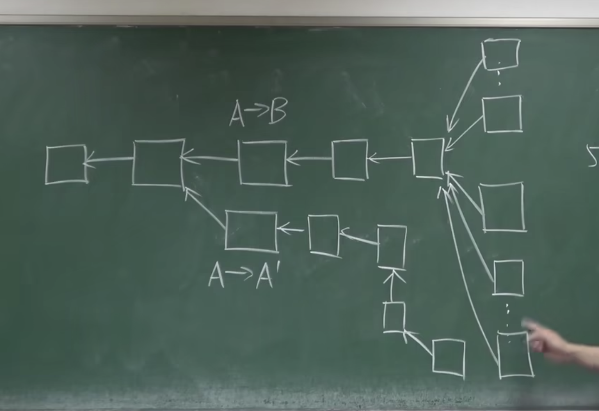

### 系统如何调整挖矿难度

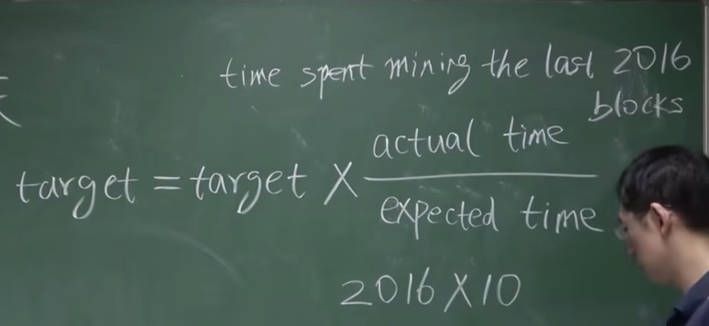
**actual time: 系统中产生最近 2016 所花费的时间**
**2016 \* 10min: 预期时间**
可见，如果实际实际比较长，target 会比较大，相应的挖矿难度会降低；如果实际实际比较短，target 会比较小，相应的挖矿难度会增大。

> 如何让所有矿工都愿意调整这个挖矿难度呢？
> 这一调整算法在代码中已经写入，如果有恶意节点故意不调，其所产生的区块不会被大多数诚实的节点承认。
> 在 block header 中有一个 nbits 的域，它是对 target 的编码存储（target 为 256 位，nbits 为 32 位，也就是说 block header 并未直接存储 target），其他节点在进行合法性验证时候会验证 nbits 域是否合法，不合法则对该区块不予以承认。

## 挖矿

由于硬件限制，BTC 系统中分为轻节点和全节点
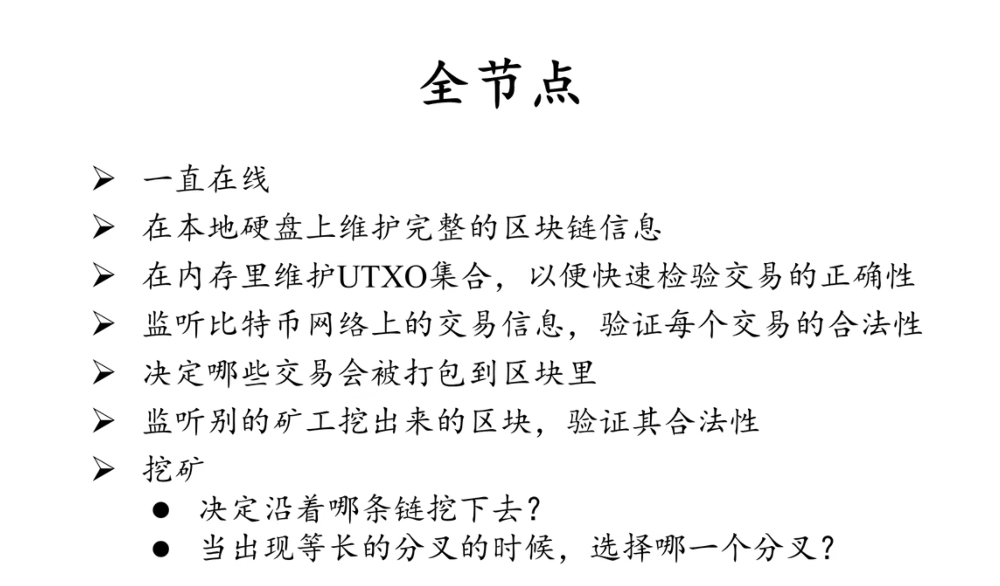

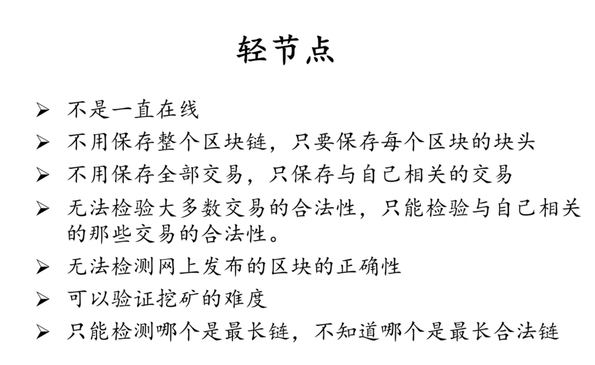
在比特币网络中，大多数节点都是轻节点。如果只是想进行转账操作，不需要挖矿，就无需运行一个全节点。在挖矿过程中，如果监听到别人已经挖出区块延申了最长合法链，此时应该立刻放弃当前区块，在本地重新组装一个指向最后这个新合法区块的候选区块，重新开始挖矿。

### 挖矿设备演化

目前，挖矿设备逐渐趋于专业化，其经历了三个过程，总体趋势从通用到越来越专用。
普通 CPU -> GPU ->ASIC 芯片（挖矿专用矿机）
定制 ASIC 芯片 只能挖某一种固定的币， 除非有相同的 miming puzzle

### 矿池：

> 挖矿另一个趋势便是大型矿池的出现。对于单个矿工来说，即使使用了 ASIC 矿机，其算力在整个系统中仍然只占据很少一部分，即使从平均收益看有利可图，但收入很不稳定。
> 此外，单个矿工除挖矿还要承担全节点其他责任，造成了算力的消耗。

因此，为了解决这些问题，便引入了**矿池**的概念。
通常是一个全节点驱动多台矿机。矿工只需要不停计算哈希值，而全节点其他职责由矿主来承担。ASIC 芯片只能计算哈希值，不能实现全节点其他功能。此外，矿池出现解决了单个矿工收益不稳定的问题。当获得收益后，所有矿工对收益进行分配，从而保证了收益的稳定性。
矿池一般具有两种组织形式。1.类似大型数据中心（同一机构），集中成千上万矿机进行哈希计算。2.分布式。矿工与矿主不认识(不同机构)，矿工与矿主联系，自愿加入其矿池，矿主分配任务，矿工进行计算，获得收益后整个矿池中所有矿工进行利益分配。

### 矿池利益分配方法

假使第二种情况，矿工来源于五湖四海（非同一机构），收益应该如何分配？

1. 思路一：平均分配，所有人平分出块奖励。
   这一点有些类似我国某段历史时期，大家一起"吃大锅饭"，会导致某些矿工懈怠，不干活（挖矿要费电，需要成本）。
   所以，这里也需要进行**按劳分配**，需要一个工作量证明的方案。如何证明每个矿工所作的工作量呢？
2. 思路二：降低挖矿难度（可行方案）。
   假设原本挖矿难度要求，计算所得 126 位的哈希值前 70 位都必须为 0，现在降低要求，只需要前 60 位为 0，这样挖矿会更容易挖到。当然，这个哈希是不会被区块链所承认的，我们将其称为一个 share，或 almost valid share。矿工每挖到一个 share，将其提交给矿主，矿主对其进行记录，作为矿工工作量的证明。等到某个矿工真正挖到符合要求的的区块后，根据所有矿工提交的 share 数量进行分配。
   因为每个矿工尝试的 nonce 越多，挖到矿的可能性越大，所能得到的 share 也会越多，所以这种方案作为工作量证明方案是可行的。

大型矿池越容易发动 51%攻击

- 分叉攻击
- bo'ycott 封锁交易

### 矿池出现的优劣

优点：解决了矿工收入不稳定的问题，减轻了矿工的负担。
缺点：威胁到了区块链系统的安全，使得 51%攻击变得容易起来（s）。

## 比特币脚本

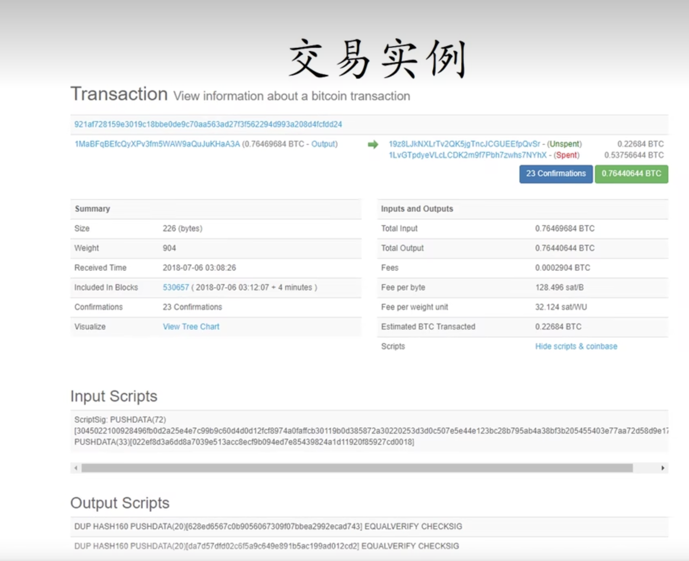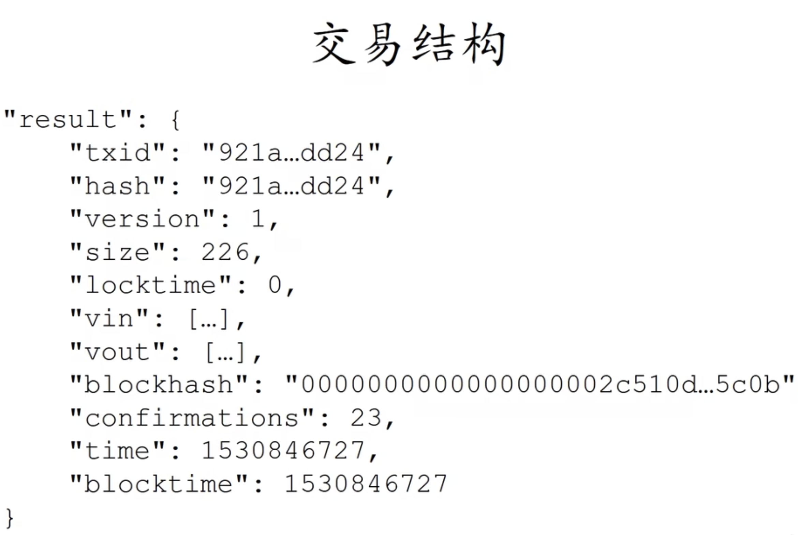

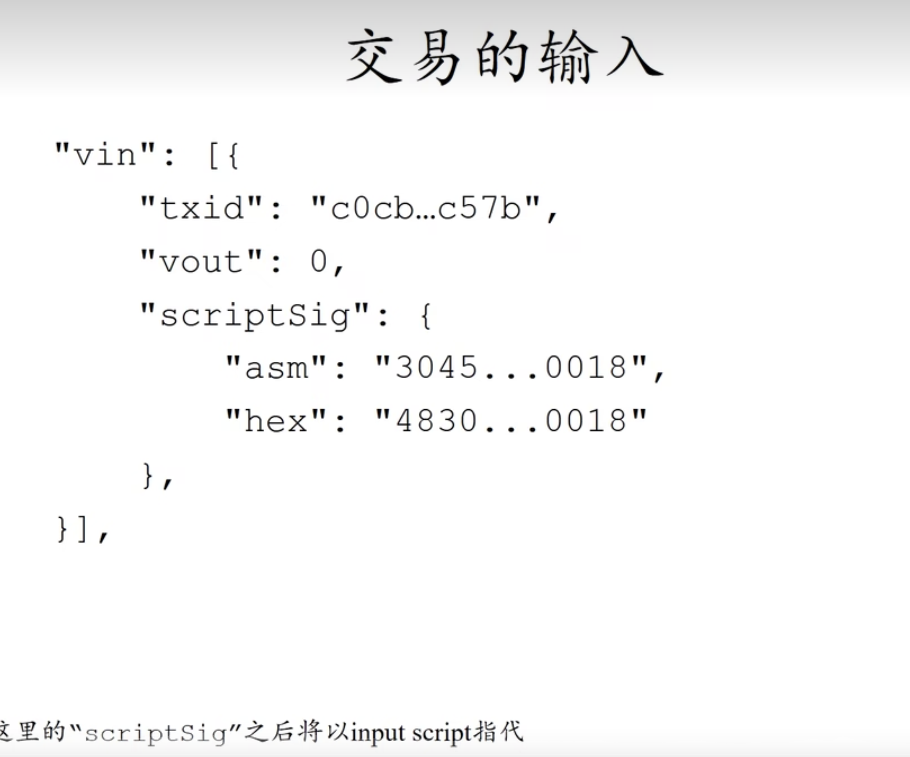

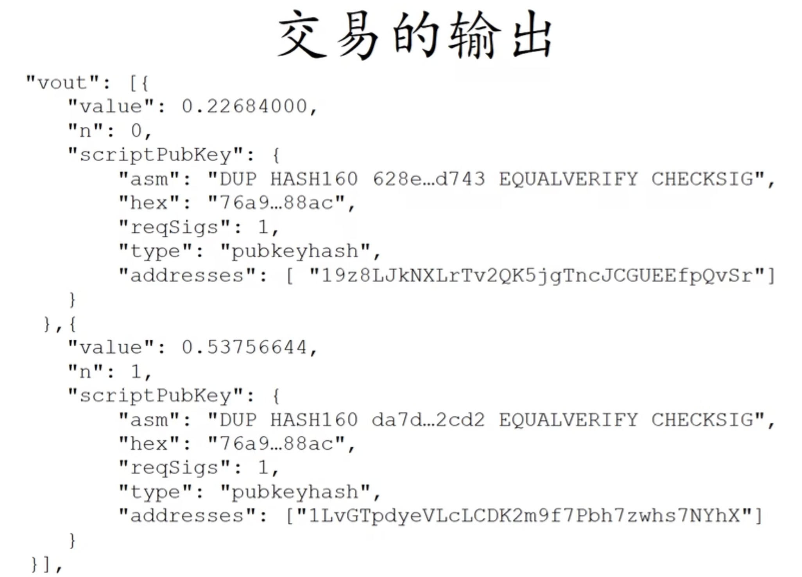

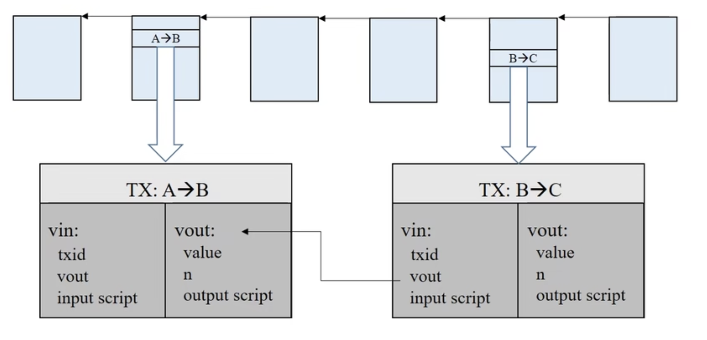

## 分叉

state fork

- forking attack
- deliberate fork

protocal fork

- hard fork:硬分叉 --- 如果不愿更新，肯定会出现永久性分叉

  - 旧节点不认可新的 feature
  - e.p : block limit size 大概每秒 7 笔交易 1M=>4M
  - 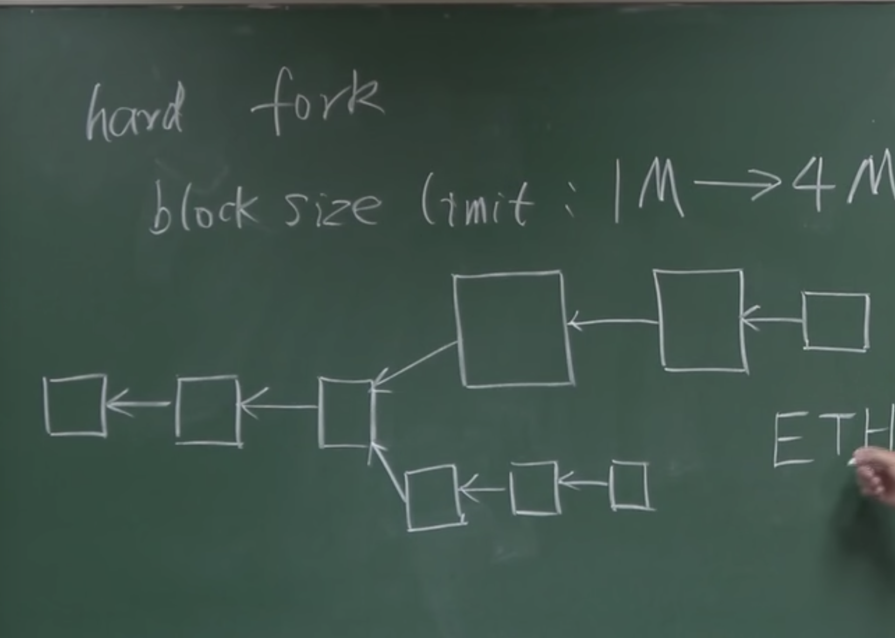
  -

- soft fork 软分叉--- 不会出现永久性分叉
  - 新协议导致原先的区块可能不再合法
- 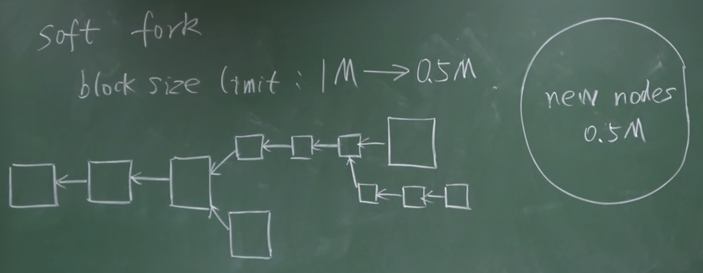

## 匿名性

- 比特币如何对应现实中某人
  - 资金转入/转出
- 如何从交易中推断账户
  - 交易时间推算！
- 如何尽量提高匿名性
  - 应用层 多路径转发 -- TOR 洋葱
  - coin mixing
- 零知识证明
  - 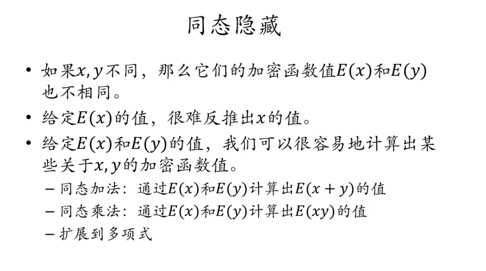
- 盲签
- 零币和零钞——专门为匿名性设计的货币

## 思考

- 哈希指针
  - 全节点将区块存储在 key：value 数据库中
  - 常用 k:v = levleDB
  - 根据最后一个区块可以找到全链关系
- 区块恋
  - 私钥截断每人一半
  - 问题： 已知一半秘钥后，破解难度指数级降低。
  - 安全性跟私钥长度至相关
  - 多人账号 可用多重签名达成
- 分布式共识
- 比特币稀缺性
  - 吸引旷工 提升收益 || 降低消耗
  - 货币金融学

# ETH

- 添加智能合约支持

  - 去中心化的合约
    > 如果说比特币系统本身是一个货币应用，以太坊则由于智能合约，升级成为了一个平台，用户可以依据该平台自行开发业务应用。

- 出块时间 => 10s
- 基于 ghost 机制的共识协议
- memry hard mining puzzle
- 权益证明取代工作量证明

## 账户

btc：

- 无法准确展示当前账户拥有多少币
- 每次交易都需要将上次得到的输出一次性都转出去

eth：

- 基于账户的模型
- 全节点维护状态树 ---所有账户的状态 也就是余额
- reply attack 重放攻击
  - 收款方，将交易多次广播，达成多次转账交易
    - 增加已经交易数的表示 nonce

以太坊系统中存在两类账户：外部账户和合约账户。

1. 外部账户：类似于 BTC 系统中公私钥对。存在账户余额 balance 和计数器 nonce
2. 合约账户：并非通过公私钥对控制。(不能主动发起交易，只能接收到外部账户调用后才能发起交易或调用其他合约账户)其除了 balance 和 nonce 之外还有 code(代码)、storage(相关状态-存储)

## 数据结构

### 状态树：

思考如何组织账户的数据结构

1. 我们能否像 BTC 中，将哈希表的内容组织为 Merkle Tree？
   但当新区块发布，哈希表内容会改变，再次将其组织为新的 Merkle Tree?如果这样，每当产生新区块(ETH 中新区块产生时间为 10s 左右)，都要重新组织 Merkle Tree，很明显这是不现实的。
   需要注意的是，比特币系统中没有账户概念，交易由区块管理，而区块包含上限为 4000 个交易左右，所以 Merkle Tree 不是无限增大的。而 ETH 中，Merkle Tree 来组织账户信息，很明显其会越来越庞大。
   实际中，发生变化的仅仅为很少一部分数据，我们每次重新构建 Merkle Tree 代价很大
2. 那我们不要哈希表了，直接使用 Merkle Tree，每次修改只需要修改其中一部分即可，这个可以吗？
   实际中，Merkle Tree 并未提供一个高效的查找和更新的方案。此外，将所有账户构建为一个大的 Merkle Tree，为了保证所有节点的一致性和查找速度，必须进行排序。
3. 那么经过排序，使用 Sorted Merkle Tree 可以吗？
   新增账户，由于其地址随机，插入 Merkle Tree 时候很大可能在 Tree 中间，发现其必须进行重构。所以 Sorted Merkle Tree 插入、删除(实际上可以不删除)的代价太大。

既然哈希表和 Merkle Tree 都不可以，那么我们看一下实际中以太坊采取的数据结构：MPT。

- **MPT **
  - trie

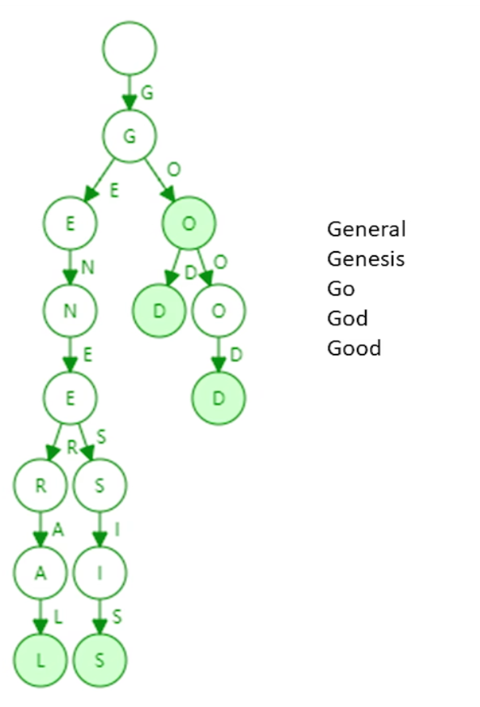
patricia tree/trie  
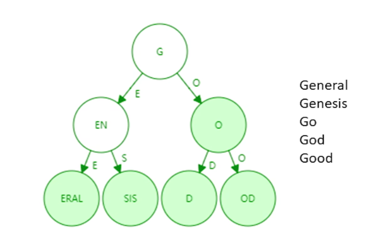
路径压缩
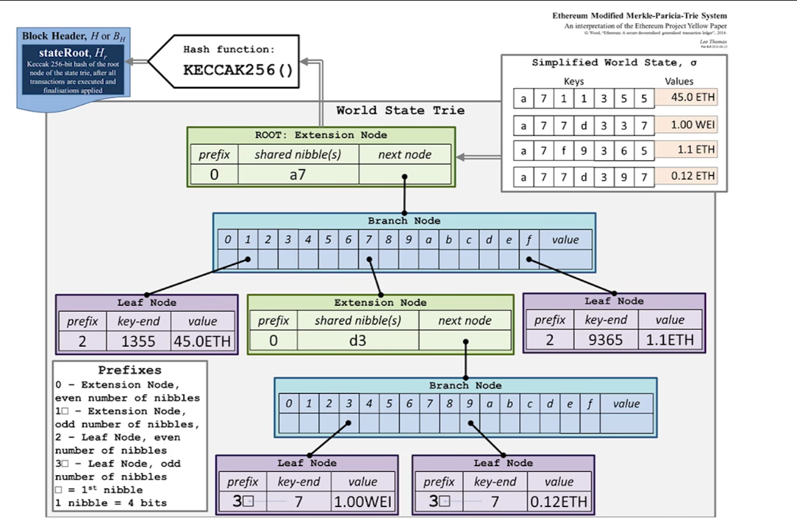

状态树会保留历史状态
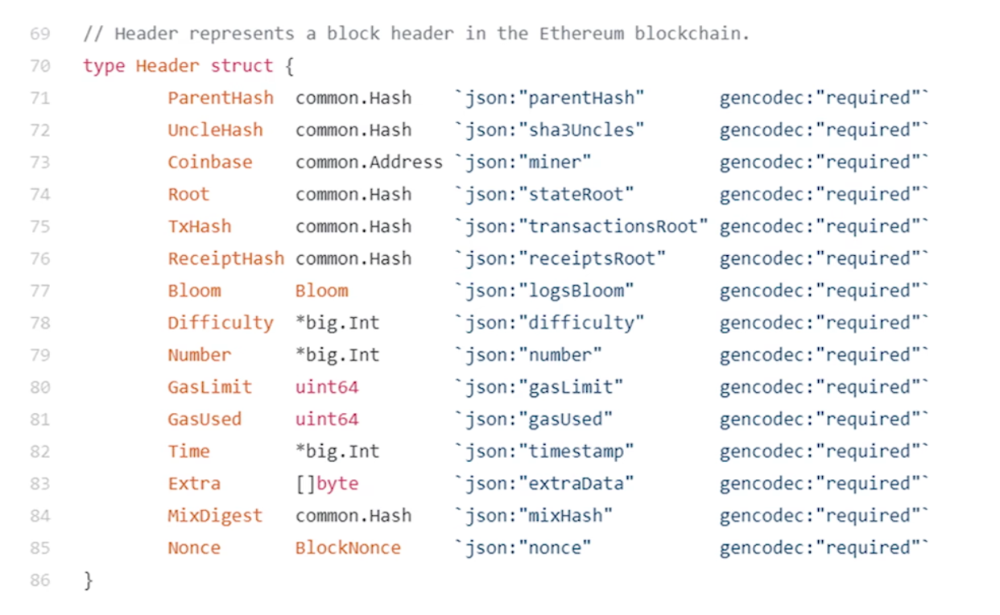

### 交易树、收据树

bloom filter

## GHOST

BTC 系统中出块时间为 10min，而以太坊中出块时间被降低到 15s 左右，虽然有效提高了系统反应时间和吞吐率，却也导致系统临时性分叉变成常态，且分叉数目更多。这对于共识协议来说，就存在很大挑战。在 BTC 系统中，不在最长合法链上的节点最后都是作废的，但如果在以太坊系统中，如果这样处理，由于系统中经常性会出现分叉，则矿工挖到矿很大可能会被废弃，这会大大降低矿工挖矿积极性。而对于个人矿工来说，和大型矿池相比更是存在天然劣势。
对此，以太坊设计了新的公式协议——GHOST 协议(该协议并非原创，而是对原本就有的 Ghost 协议进行了改进)。

激励机制，促使分叉尽可能早的合并至主链

- uncle block

如图，假定以太坊系统存在以下情况，A、B、C、D 在四个分支上，最后，随着时间推移 B 所在链成为最长合法链，因此 A、C、D 区块都作废，但为了补偿这些区块所属矿工所作的工作，给这些区块一些“补偿”，并称其为"Uncle Block"（叔父区块）。
规定 E 区块在发布时可以将 A、C、D 叔父区块包含进来，A、C、D 叔父区块可以得到出块奖励的 7/8，而为了激励 E 包含叔父区块，规定 E 每包含一个叔父区块可以额外得到 1/32 的出块奖励。为了防止 E 大量包含叔父区块，规定一个区块只能最多包含两个叔父区块，因此 E 在 A、C、D 中最多只能包含两个区块作为自己的出块奖励

## 挖矿算法


## 难度调整

## 权益证明

## 智能合约

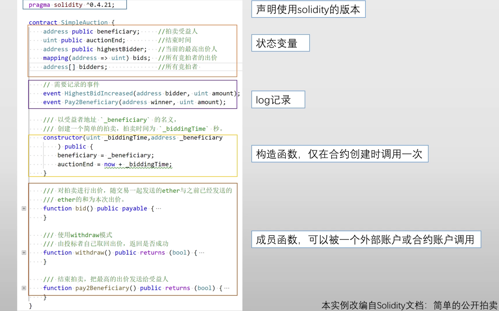

#

## 附录

### 哈希

- 将数据转成固定长度字符串。
- 如果两个散列值不同，原始输入也不同。
- **有损转换，故不可逆。**
- 不同输入可能产生相同的散列值。
- 输入的微小变化导致散列值的显著变化。
- 无法从散列值逆向推导出原始数据。
- **抗碰撞性**：难以找到两个不同的输入产生相同散列值。
- MD5（Message Digest Algorithm 5）： 生成 128 位的哈希值，已被认为不够安全。
- SHA-1（Secure Hash Algorithm 1）： 生成 160 位的哈希值，同样存在安全性问题。
- SHA-256（Secure Hash Algorithm 256）：生成 256 位的哈希值，是 SHA-2 家族的一部分，广泛应用于安全场景。
- SHA-3（Secure Hash Algorithm 3）： 最新的 SHA 系列算法，具有更高的安全性。

## 签名

- **比特币系统的签名用到是私钥加密吗？**

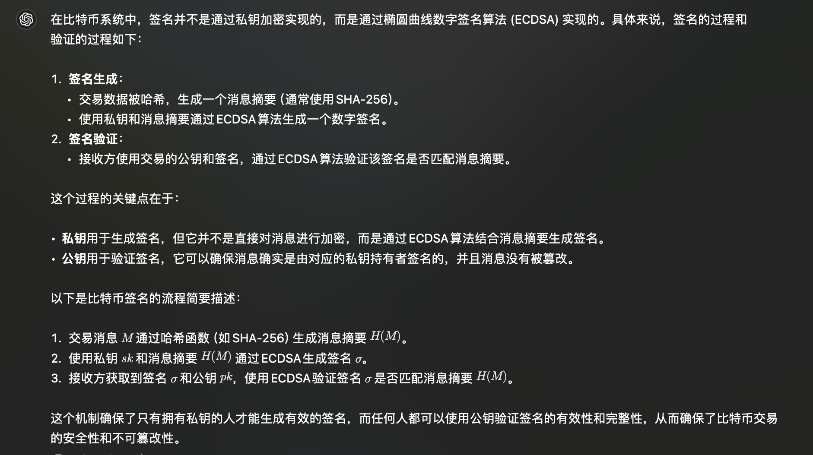

## 数据结构

- 在实际应用中，用户保存区块链的方式是？

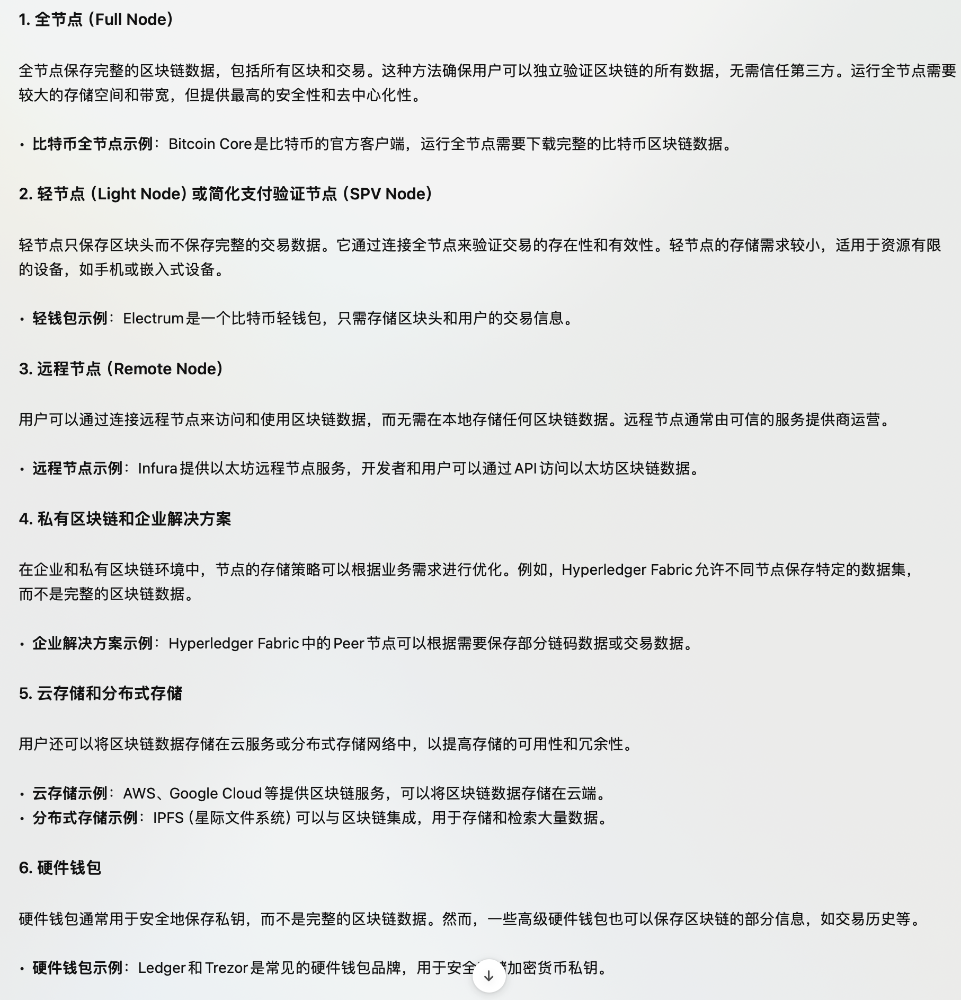

- 轻节点如何验证交易已被写入到区块链中

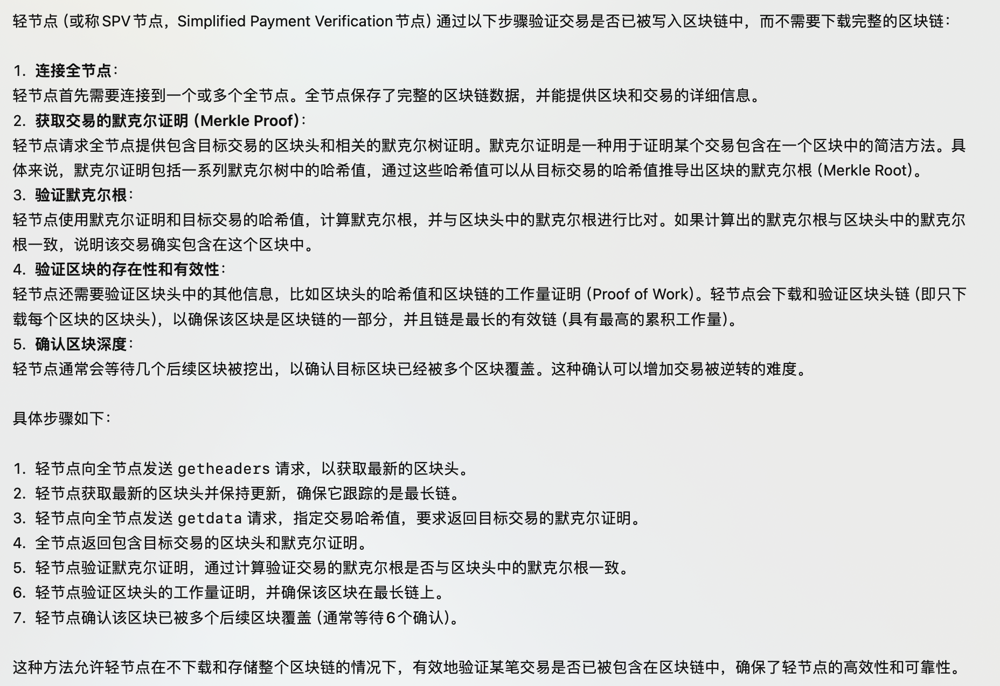
区块体中的交易数据相互独立。
区块链区块体中的交易数据通常不直接包含默克尔树的父节点（parent node）。
区块体主要包含的是交易的详细信息。默克尔树的父节点和其他中间节点的哈希值通常是在需要验证交易时动态计算出来的，而不是直接存储在区块体中。

## 共识

矿工会预先组建区块，此时暂未获得记账权，如何进行 coinbase 交易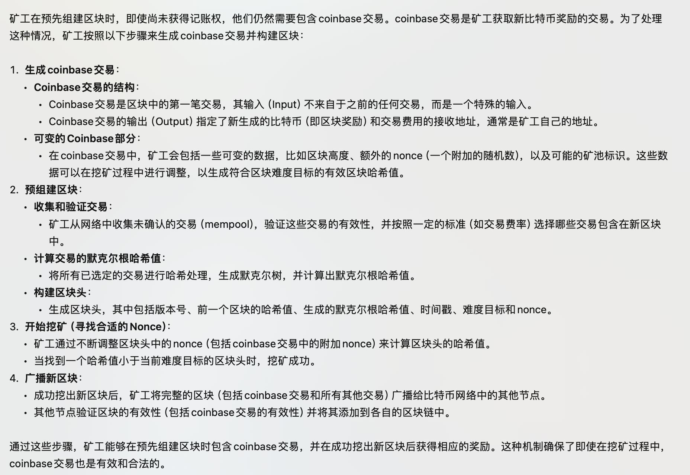每个交易中输入和输出的内容分别包含？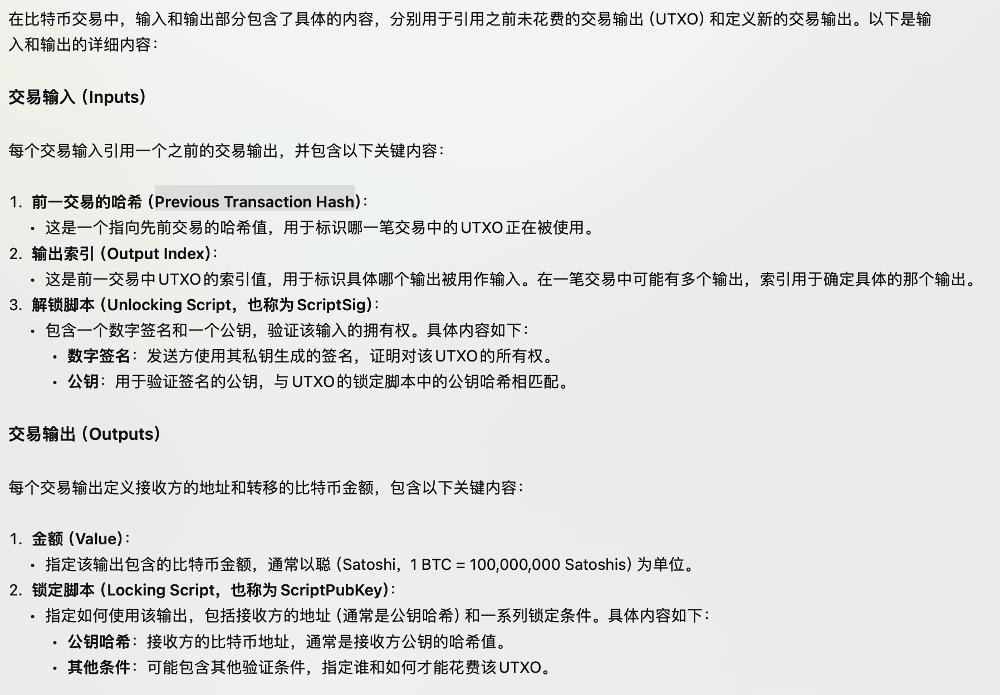[区块链 百日筑基 | 登链社区 | 区块链技术社区](https://learnblockchain.cn/article/7981)
