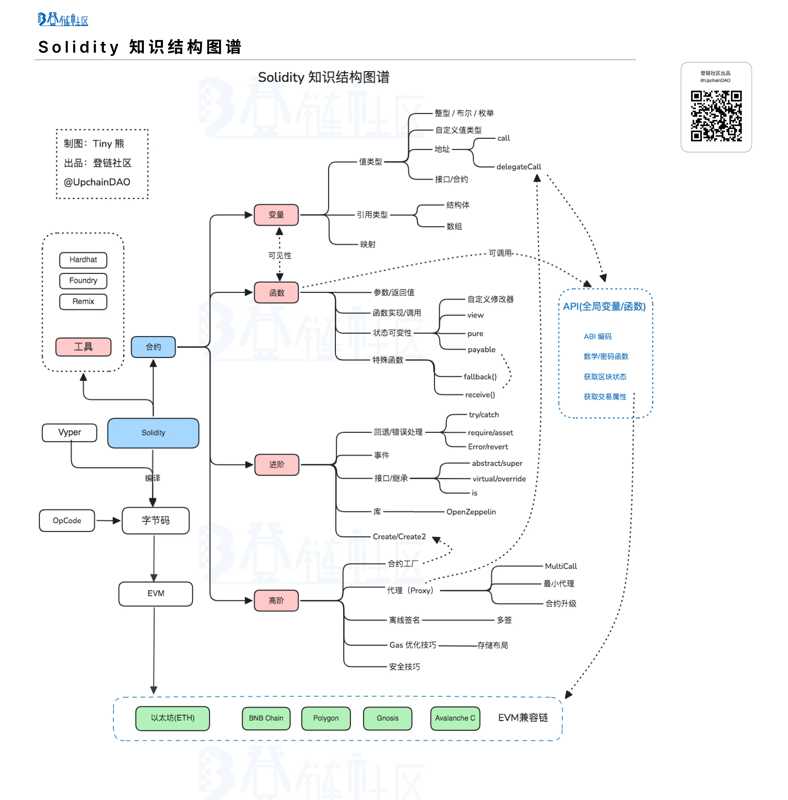

# solidity

## 概念

[Solidity](https://learnblockchain.cn/docs/solidity/) 是一门面向合约的、为实现智能合约而创建的高级编程语言，也是用于开发以太坊智能合约)最受欢迎的语言之一。这门语言受到了 C++，Python 和 Javascript 语言的影响，其设计目的是能在 以太坊虚拟机（EVM） 上运行。

Solidity 是静态类型语言，具备面向对象特性：支持继承、库、接口和复杂的用户定义类型。

## Solidity 开发工具

- Remix IDE：
  Remix 是一个基于浏览器的开发环境，提供了编写、编译、调试和部署 Solidity 智能合约的全套工具。
- Hardhat：
  Hardhat 是一个 Solidity 开发工具，可以轻松地编写、测试和部署智能合约。Hardhat 使用 Node 进行包管理，如果你熟悉 Node 及 Javascript， Hardhat 将非常简单上手。
- Foundry：
  Foundry 是一个 Solidity 开发工具，用于构建、测试、模糊、调试和部署 Solidity 智能合约， Foundry 的优势是以 Solidity 作为第一公民，完全使用 Solidity 进行开发与测试，如果你不太熟悉 JavaScript ， 使用 Foundry 是一个非常好的选择，而且 Foundry 构建、测试的执行速度非常快。
- OpenZeppelin：
  OpenZeppelin 提供了可复用的智能合约库和安全工具，帮助开发者编写安全的合约。

## 学习图谱

